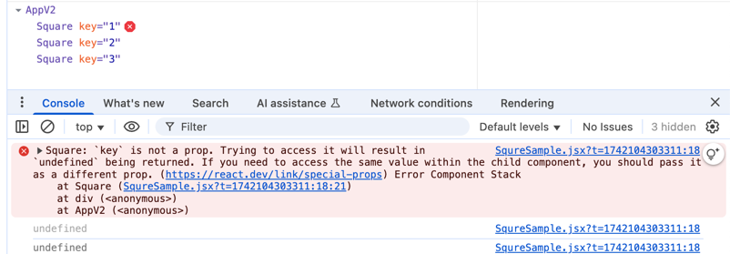

# 스터디 1주차 (3/16)

## Component

- 리액트틑 UI 를 Component 로 나누어서 관리한다. (너무 부럽다..)
- 화면을 구성하는 특정 값의 변경에 따라 별도의 이벤트를 직접 호출하여 연관된 엘리멘트의 값을 변경하여 UI 를 새롭게 그려야한다.
- 또한 NPM, Webpack, Babel 등을 이용하지 않아서 개발에 어려움이 많다. 하지만 리액트는 기본적으로 이러한 기술을 사용한다는 전제로 개발되었다. (부럽다..)
    - 러닝커브에 대해 리소스를 투자할 여력이 없음.
- Component 는 **재사용**이 가능하다.
- 이전 리액트에서는 **Class** 를 사용하는 방식으로 컴포넌트를 표현했지만 최근(>=16) 버전에서는 **Function** 방식을 사용한다.
    - 함수는 호출 시점의 상태(값) 을 유지하지 못하지만 hook(?) 을 통해 관리한다고 한다.

```jsx
function Sqaure(props) {
    return (
        <button className="square" onClick={props.onClick}>
            {props.value}
        </button>
    );
}

/* 컴포넌트를 사용하는 코드*/
function App() {
    return (
        <div>
            <Sqaure value={1} onClick={() => alert('click')}/>
        </div>
    );
}

```

- [IIFE](https://developer.mozilla.org/ko/docs/Glossary/IIFE) 방식을 통해 외부 환경에서 변수 오염을 방지했지만 리액트는 기본적으로 컴포넌트
  변수를 관리하기 때문에 외부 이러한 문제가 발생하지 않는다.
    ```javascript
    const App1 = (function() {
        var a = 1;
        console.log(a);
    })();
  
    const App2 = (function() {
        var a = 2;
        console.log(a);
    })();
  ```

- 컴포넌트는 자식 <-> 부모 간의 데이터를 주고 받을 수 있으며 이를 **props** 라고 한다.
- 하나의 부모는 다수의 자식 컴포넌트를 포함할 수 있다.
    ```jsx
    /* Sqaure 라는 자식 컴포넌트 */
    function Sqaure(props) {
        return (
            <button className="square" onClick={props.onClick}>
                {props.value}
            </button>
        );
    }
    
    /* <Sqaure> 컴포넌트를 사용하는 <App> 부모 컴포넌트 */
    function App() {
        return (
            <div>
                <Sqaure value={1} onClick={() => alert('click')}/>
                <Sqaure value={2} onClick={() => alert('click')}/>
            </div>
        );
    }
    ```

- 부모에서 넘겨준 props 는 부모에서 정의한 코드에서 tag 내 정의된 모든 attribute 를 의미한다. (사실 확인 안함)
- key 는 부모 컴포넌트에서 식별키로 사용되는 값이며 props 를 통해 전달 받을 수 없다.  
  
- 추가로 **children** 이라는 특수한 props 가 존재하며 이는 부모 컴포넌트에서 자식 컴포넌트에게 넘겨준 값이다.
  ```jsx
  function Square(props) {
    /* (2) 자식 컴포넌트에선는 부모에서 넘겨준 key props 에 접근할 수 없다.*/
      console.log(props.key); // undefined
      return (
          <div>
              <button className="square" onClick={props.onClick}>
                  {props.value}
              </button>
              {props.children}
               {/* (4) 부모컴포넌트에서 넘겨준 자식계층에 사용될 JSX 를 children 으로 받을 수 있다. */}
          </div>
      );
  }
  
  function AppV2() {
      return (
          <div>
              {
                  [1, 2, 3].map((value) => {
                      return (
                          /* 부모 컴포넌트에서 key 를 전달*/
                          <Square key={value} value={value}>
                              <div>Hi {value}</div> {/* (3) 자식 커포넌트 내부에 정의될 값을 부모에서 넘겨줄 수 있다.*/}
                          </Square>
                      );
                  })}
          </div>);
  };
  ```

## State (상태)

### 리액트 state 에 대한 소고

- React 의 장점은 프론트엔드 UI 개발함에 있어서 화면의 상태의 변경을 UI 에 반영시켜준다는 것
- 현재 고전적인 내가 개발하는 jquery + 타임리프 개발 방식에서는 자바스크립트의 DOM API 를 이용하여 각각의 엘리멘트의 이벤트를 제어하고 있으며
  개발자의 역량에 따라 코드 퀄리티가 매우 다양하며 획일화된 코드 작성 스타일을 유지하기 힘들다.
- 비지니스 로직의 상태(값)의 변경이 UI 에 적용되며 이것에 대한 API 를 제공

### State 정리

- **import {useState} from "react";** 에서 가져온 useState 를 통해 상태를 관리할 수 있다.
- IncrementButton 는 JSX 문법으로 쓰여졌지만 본질은 함수
- useState
  ```typescript
      /**
     * Returns a stateful value, and a function to update it.
     *
     * @version 16.8.0
     * @see {@link https://react.dev/reference/react/useState}
     */
    function useState<S>(initialState: S | (() => S)): [S, Dispatch<SetStateAction<S>>];
  
    type Dispatch<A> = (value: A) => void;
  
    type SetStateAction<S> = S | ((prevState: S) => S);
  ```
    - 함수 초기값을 특정값 또는 초기값을 설정하는 Supply 함수를 넘겨 받는다.
    - 반환값으로는 초기값타입과 상태를 변경할 수 있는 함수를 반환한다.
    - 초기값을 변경하는 함수 Dispatch 는 SetStateAction 을 통해 상태를 변경할 수 있다.
        - 초기값과 마찬가지로 특정값 또는 값을 변경하는 Function Type 함수를 넘겨 받는다.

  ```jsx
- 함수는 매호출 당시 내부 값을 외부로 export 하지 않았다면 상태를 유지할 수 없지만 리액트는 useState 를 통해 상태를 유지할 수 있다.
    - 구체적인 메커니즘은 아직 모르지만.. root 로부터 함수 호출의 순서를 시퀀스(순서)로 관리하여 함수의 고유의 상태를 관리한다고함.

```jsx
import {useState} from "react";

function IncrementButton() {
    const [value, setValue] = useState(0);
    const handleClick = () => {
        const newValue = value + 1
        setValue(newValue);
        console.log(`value: ${value}, newValue: ${newValue}`);  // value: 0, newValue: 1
    }
    return (
        <div>
            <span>{value}</span>
            <button onClick={handleClick}>UP</button>
        </div>
    )
}

function AppV2() {
    return (
        <div>
            <IncrementButton/>
        </div>
    );
}

export default AppV2;

```

- console.log 의 결과가 **"value: 0, newValue: 1"** 가 출력되고 있다.
- setXX 함수를 통해 변경된 값을 기더라도 값이 즉시 변경되는 것은 아니다.
    - 일종의 task queue 에 쌓아 두고 있다가 다음 렌더링 시점에 변경된 값을 적용한다.
    - [state, setState] 의 ts 정의부를 보면 알 수 있듯이 state 는 proxy 처리를 하지 않은 순수한 오브젝트(or primitive type value) 이다.
- task queue 를 통해 값이 변경되면 트리거(?) 가 발생하여 rerender 을 진행하는 것으로 보인다.

## 궁금한점

### React

- Vue 에서는 하위 컴포넌트에서 데이터의 변경을 **emit** 를 통해 부모 컴포넌트에게 전달하는 걸 권장했다. React 는 스스로 변경할 수 있는 Function
  넘기는 것 같다. 다들 어떤 걸 권장하는지 궁금하다.
- 코드 작성시 함수 선언식과 화살표 함수를 용도에 따라 구분해서 사용? 그렇다면 기준은 어떻게?

### next.js

- 어드민을 제외한 사용자 페이지의 경우 직접 스타일링을 하는 것인지 아니면 퍼블리셔가 관리하는 전역 css 를 받아오시는지?
- Next.js 내부적으로 WAS 를 사용하는 것으로 알고 있음. WAS 레벨에서 발생하는 예외(또는 에러) 는 어떻게 로깅 하고 계시나요?
    - datadog 과 같은 모니터링툴을 사용..?
- Node.js 의 경우 Single Thread 동작하는데 대량의 요청을 처기하는 과정에서 OOM 이 발생하셨던 경험이 있으신가요?
    - Request 를 Limit 하는 방법이 제공되는지?
- 암호 복호화를 Node 기반 애플리케이션에서 수행한다면 CPU 사용량이 높아지는데 이에 대한 경험 있으신 분 계시나요..?
    - Java 와 같은 멀티스레드 기반의 별도 애플리케이션에 API 호출을 통해 처리(?)

## 참고

- [babeljs](https://babeljs.io/repl#?browsers=defaults%2C%20not%20ie%2011%2C%20not%20ie_mob%2011&build=&builtIns=false&corejs=3.21&spec=false&loose=false&code_lz=Q&debug=false&forceAllTransforms=false&modules=false&shippedProposals=false&evaluate=false&fileSize=false&timeTravel=false&sourceType=module&lineWrap=true&presets=env%2Creact%2Cstage-2&prettier=false&targets=&version=7.26.10&externalPlugins=&assumptions=%7B%7D)
