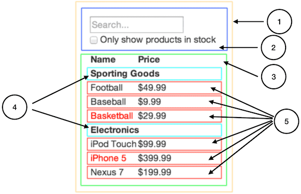

# 스터디 1주차 (3/23)

## 1단계: UI를 컴포넌트 계층 구조로 나누기

- 모든 컴포넌트(와 하위 컴포넌트)의 주변에 박스를 그리고 그 각각에 이름을 붙여준다.
    - **단일책임원칙**을 이용하여 함수 또는 클래스를 나누는 것처럼 컴포넌트를 분리한다.

```
- FilterableProductTable
    -SearchBar
    - ProductTable
        - ProductCategoryRow
        - ProductRow
```



## 2단계: React로 정적인 버전 만들기

- 앱을 만들 때 하향식(top-down)이나 상향식(bottom-up)으로 만들 수 있지만 프로젝트가
  커지면 상향식으로 만들고 테스트를 작성하면서 개발하기가 더 쉽다.

## 3단계: UI 상태의 최소하면서도 완전한 표현 찾기

- UI를 상호 작용적으로 만들려면 사용자가 기본 데이터 모델을 변경하도록 해야 합니다.
    - 상태를 앱이 기억해야 하는 **최소한의 변경** 데이터 집합
    - 필요한 상태의 절대 최소 표현을 파악하고 나머지는 주문형으로 계산
        - Tips
            - 시간이 지나도 변하지 않는다. -> 그렇다면 state 가 아니다.
            - 부모로부터 props를 통해 전달된다. -> 그렇다면 state 가 아니다.
            - 컴포넌트에 있는 기존 state 또는 props를 기반으로 계산할 수 있다.

- **Product List**:   
  외부에서 생성되는 데이터(mock or Server Data) 에서 가져와 FilterableProductTable 의 props 로 전달
  현재 컨텍스트에서는 props 이지만 다른 컨텍스트에서는 state 일 수도 있다.
- **Search Text**:   
  사용자와 상호작용을 통해 변경될 수 있는 값이며 UI 에서만 사용되므로 state 로 관리
- **Check Box**:   
  사용자와 상호작용을 통해 변경될 수 있는 값이며 UI 에서만 사용되므로 state 로 관리
- **Filtered Product List**:   
  Product List 와 Search Text, Check Box 에 의해 계산되는 값이므로 state 관리가 불필요하다.   
  이 값 또한 컨텍스트에 따라 state 로 관리될 수 있다.
- 즉, 현재 예제에서는 CheckBox, Search Text 만이 state 로 관리될 수 있다.

## 4단계: 상태가 어디에 위치해야하는지 식별하자!
Commit: f1ced919

- 모든 컴포넌트가 공통으로 필요로하는 상태를 식별하자!
- 그들의 근접한 공통 부모 컴포넌트를 식별하자!
- 상태가 어디에 위치해야하는지 결정한다.
    - 공통으로 필요로하는 상태를 바로 부모 컴포넌트를 통해 전달
    - 또한 공통 부모 컴포넌트의 조상 컴포넌트에 넣어 전달
    - 적당한 컴포넌트가 없는 경우, 상태를 보관하기 위해 새로운 컴포넌트를 생성하여 전달
- 예제에서는...
    - ProductTable:   
      Search Text, Check Box 를 통해 필터링된 값을 랜더링해야한다.
    - SearchBar:   
      사용자의 입력값을 관리하며 또한 ProductTable 과 값을 공유해야한다.
    - 따라서 state 는 ProductTable 와 SearchBar 의 공통 조상 FilterableProductTable 에 위치시킨다.
      ```
      - FilterableProductTable (common parent)
          -SearchBar     --> (child1)
          - ProductTable --> (child2)
              - ProductCategoryRow
              - ProductRow
      ```
      
## 5단계: 역방향 데이터 흐름 추가

- 이전 단계에서 공통 부모컴포넌트(FilterableProductTable) 를 통해 전달된 props 는 하위 컴포넌트에서 변경하더라도 UI 의 변경이 일어나지 않는다.   
- 올바르게 state 를 props 로 전달되었더라도 react 에서 지정된 방식으로 데이터 변경에 대한 트리거를 발생시켜줘야한다. 
- 부모 컴포넌트 (상태를 관리하는 곳) 에서 하위 컴포넌트에게 데이터를 변경할 수 있는 방법을 전달해야한다. (트리거)


