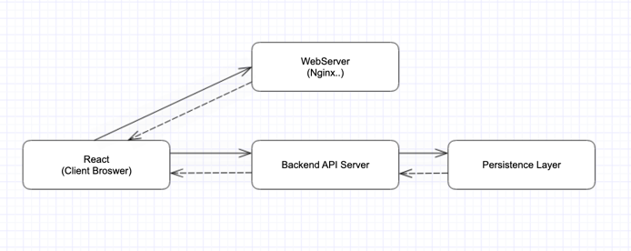
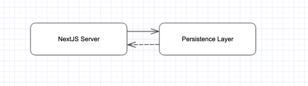
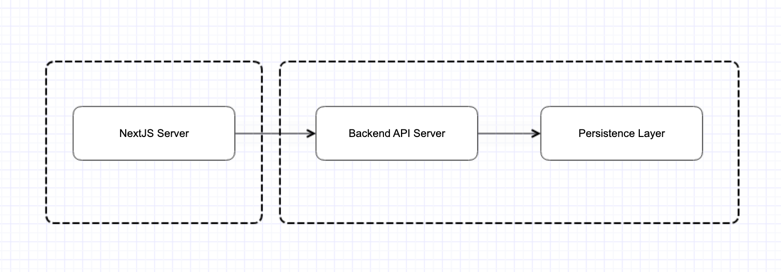
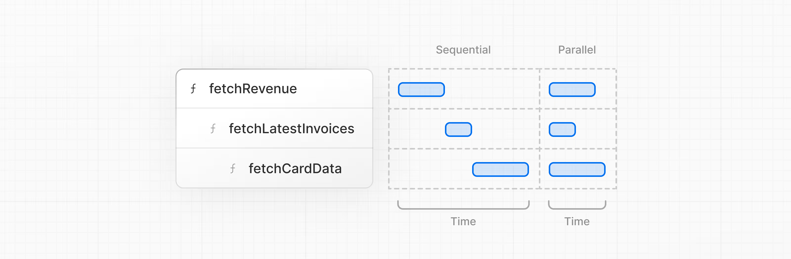

# 스터디 3주차 (3/30) - Setting Up Your Database

- **데이터 베이스 셋팅은 생략**
- Nextjs 는 node server 를 통해 실행되기 때문에 WAS 로 사용 가능
    - Node Server 의 역할을 수행 가능 (API 서버, DB 연결 등)
- 예제의 Vercel Database 를 사용하지 않고 로컬 DB 를 사용한다면 다음과 같이 `ssl: false` 로 설정한다. 설정한다.
  ```js
  const sql = postgres(process.env.POSTGRES_URL!, {ssl: false});
  ```

## Tagged templates

- 태어나서 처음보는 문법이라 정리

```js
const tagged = (strings, ...values) => {
    console.log(strings);   // 템플릿을 구성하는 문자열을 배열로 담아준다.
    console.log(values);    // 템플릿 내부 가변인자(${})를 배열로 담아준다.
    let result = '';
    strings.forEach((str, i) => {
        result += str;
        if (i < values.length) {
            result += values[i];
        }
    });
    return result;
}

const result = tagged`Hello ${'val1'} World ${'val2'}!!`; // Output: [ 'Hello ', ' World ', '!!' ], [1, 2]
console.log(result);    // Output: Hello val1 World val2!!

```

# 스터디 3주차 (3/30) - Fetching Data

- 기존 React 에서는 아래와 같이 React 코드가 실행되는 곳은 클라언트(브라우저)이기 때문에 직접적으로 DB 에 접근할 수 없었다.
  
- Server Component 로 실행되는 코드에서는 영속성 영역에 직접적으로 접근할 수 있다. (Node Server)
  
- 즉, 리액트의 기본 컴포넌트(서버) 가 생성되는 부분은 브라우저가 아닌 서버이기 때문에 직접적으로 DB 에 접근하는 코드를 실행할 수 있다.
- 소규모 애플리케이션을 제작할 때는 유용한 기능이지만, 보통은 아래와 같이 API 서버를 따로 두고 API 서버에서 DB 에 접근하는 방식을 사용한다.
  nextjs 에서 직접적으로 DB 에 접근하기 보다는 API 서버를 따로 두고 API 서버에서 DB 에 접근하는 방식을 사용하는 것이 일반적이다.
  

## 



