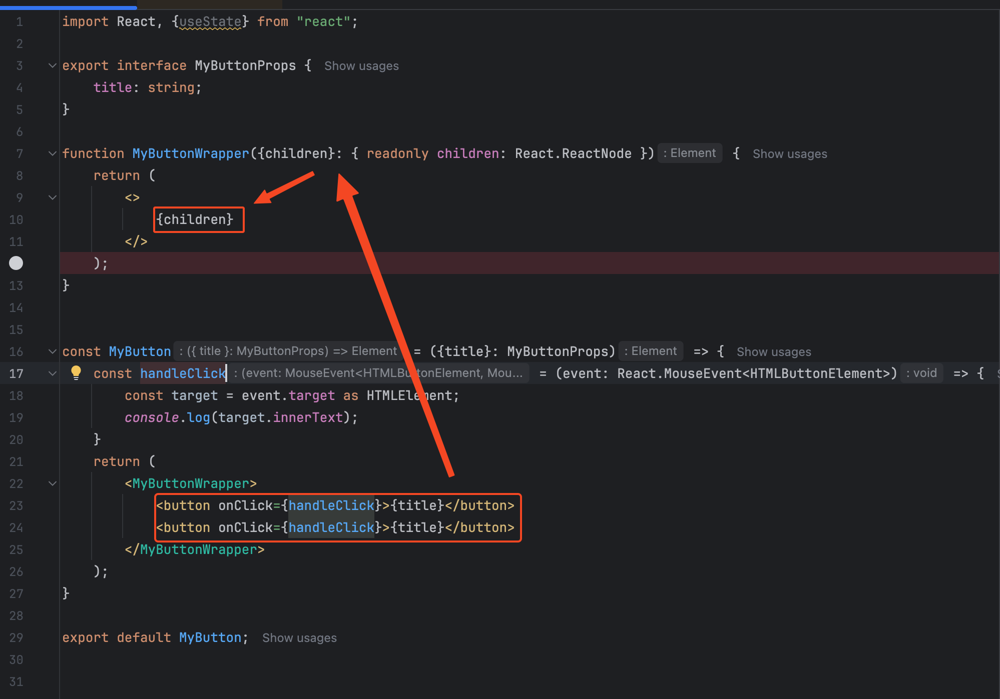
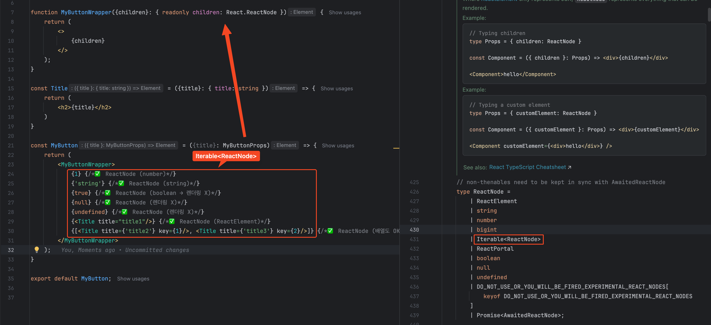
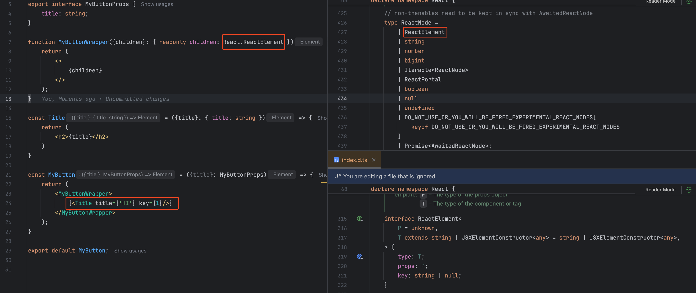
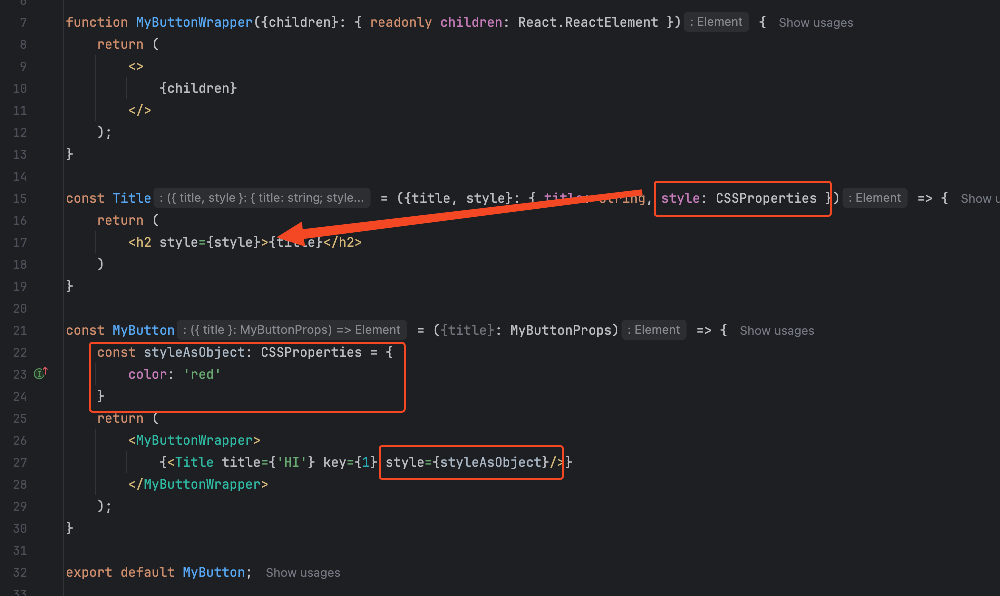
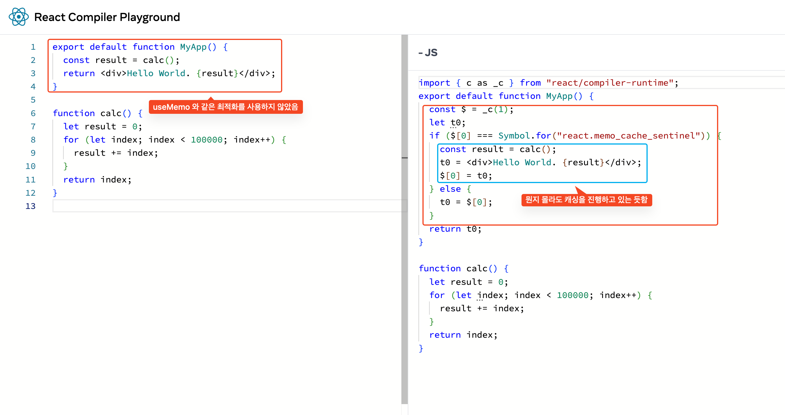
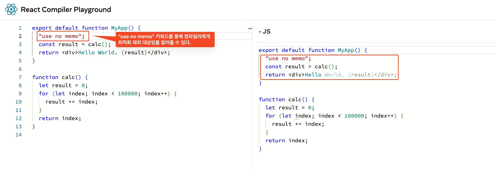

# 스터디 3주차 (3/30) - Editor Setup

## Editor

- 생략하겠습니다.

## Using TypeScript

- React (또는 관련 framework) 들은 Typescript 를 지원한다.
- 아래 명령어로 npm 을 통해 react 관련 type 정보를 추가할 수 있다.
  ```bash
  npm install @types/react @types/react-dom
  ```
- tsconfig.json 파일을 생성하여 Typescript 설정을 추가한다.
  ```json
    {
  "compilerOptions": {
    "target": "ESNext",                          // 최신 JS 기능을 사용
    "lib": ["DOM", "DOM.Iterable", "ESNext"],    // 브라우저 + 최신 ES 지원
    "allowJs": true,                             // .js 파일도 허용
    "skipLibCheck": true,                        // 타입 정의 검사를 빠르게 스킵
    "esModuleInterop": true,                     // CommonJS ↔ ES6 모듈 호환
    "allowSyntheticDefaultImports": true,        // 기본 import 허용 (babel 스타일)
    "strict": true,                              // 엄격한 타입 검사
    "forceConsistentCasingInFileNames": true,    // 파일 이름 대소문자 일관성
    "noFallthroughCasesInSwitch": true,          // switch 문 안전하게
    "module": "ESNext",                          // 모듈 시스템
    "moduleResolution": "Bundler",               // Vite/webpack에 맞게
    "resolveJsonModule": true,                   // json import 허용
    "isolatedModules": true,                     // 개별 모듈로 처리 (ts-loader용)
    "jsx": "react-jsx"                           // React 17+ JSX 자동 import (React 18용)
  },
  "include": ["src"],
  "exclude": ["node_modules"]
  }
  ```
- MyButton.jsx
  ```js 
    // MyButton.js
    import React from "react";
    
    const MyButton = ({title}) => {
        const handleClick = (event) => {
            const target = event.target;
            console.log(target.innerText);
        }
        return (
            <button onClick={handleClick}>{title}</button>
        );
    }
    
    export default MyButton;
    ```

- MyButton.tsx
  ```tsx
    import React from "react";
    
    export interface MyButtonProps {
        title: string;
    }
    
    const MyButton = ({title}: MyButtonProps) => {
        const handleClick = (event: React.MouseEvent<HTMLButtonElement>) => {
            const target = event.target as HTMLElement;
            console.log(target.innerText);
        }
        return (
            <button onClick={handleClick}>{title}</button>
        );
    }
    
    export default MyButton;
  ```

- Java 와 같은 Compile 언어는 컴파일러를 통해 타입을 체크하고 그 정보를 통해 IDE 가 적극적으로 도움을 줄 수 있지만   
  js 와 같은 인터프리터 언어의 경우 컴파일러가 별도로 존재하지 않기 때문에 IDE 가 타입을 체크하기 어렵다.
- Typescript 는 이러한 문제를 해결하기 위해 타입을 체크하고 그 정보를 IDE 에 제공하여 개발자가 더 안정적으로 개발할 수 있도록 도와준다.
- ts -> js 로 일종의 컴파일을 거치는 과정이 있고 ts 컴파일러를 통해 습득한 정보를 통해 IDE 는 개발자에게 도움(코드 추천..)을 줄 수 있다.

## Example Hooks

- React Hook 에 대한 타입도 지원한다.
  ```ts
        function useState<S>(initialState: S | (() => S)): [S, Dispatch<SetStateAction<S>>];
    // convenience overload when first argument is omitted
    /**
     * Returns a stateful value, and a function to update it.
     *
     * @version 16.8.0
     * @see {@link https://react.dev/reference/react/useState}
     */
    function useState<S = undefined>(): [S | undefined, Dispatch<SetStateAction<S | undefined>>];
    /**
     * An alternative to `useState`.
     *
     * `useReducer` is usually preferable to `useState` when you have complex state logic that involves
     * multiple sub-values. It also lets you optimize performance for components that trigger deep
     * updates because you can pass `dispatch` down instead of callbacks.
     *
     * @version 16.8.0
     * @see {@link https://react.dev/reference/react/useReducer}
     */
    function useReducer<S, A extends AnyActionArg>(
        reducer: (prevState: S, ...args: A) => S,
        initialState: S,
    ): [S, ActionDispatch<A>];
  
      /**
     * Accepts a context object (the value returned from `React.createContext`) and returns the current
     * context value, as given by the nearest context provider for the given context.
     *
     * @version 16.8.0
     * @see {@link https://react.dev/reference/react/useContext}
     */
    function useContext<T>(context: Context<T> /*, (not public API) observedBits?: number|boolean */): T;
  
      /**
     * `useMemo` will only recompute the memoized value when one of the `deps` has changed.
     *
     * @version 16.8.0
     * @see {@link https://react.dev/reference/react/useMemo}
     */
    // allow undefined, but don't make it optional as that is very likely a mistake
    function useMemo<T>(factory: () => T, deps: DependencyList): T;
  
      // A specific function type would not trigger implicit any.
    // See https://github.com/DefinitelyTyped/DefinitelyTyped/issues/52873#issuecomment-845806435 for a comparison between `Function` and more specific types.
    // eslint-disable-next-line @typescript-eslint/no-unsafe-function-type
    function useCallback<T extends Function>(callback: T, deps: DependencyList): T;
  ```

- React 뿐만 아니라 DOM API 에 대한 타입도 지원한다.

### React 이벤트 타입 시스템

- React는 브라우저 이벤트를 감싸서 `SyntheticEvent`라는 합성 이벤트 시스템을 제공한다.
    - 브라우저 간 차이를 통일
    - 추가적인 메서드를 제공
    - 타입 안전성 상승
- 일종의 Wrapper Class 이며 기존 Event 객체를 감싸고 있는 객체이며 추가적인 API 를 제공한다.

#### 주요 SyntheticEvent 계열 타입

- `<T>` 에 해당하는 값에는 브라우저 DOM 이벤트 객체가 들어간다.

| 이벤트 분류 | 타입                   | 핸들러 타입 (alias)              | 설명                        |
|--------|----------------------|-----------------------------|---------------------------|
| 입력     | `ChangeEvent<T>`     | `ChangeEventHandler<T>`     | input, select, textarea 등 |
| 폼      | `FormEvent<T>`       | `FormEventHandler<T>`       | form 제출                   |
| 키보드    | `KeyboardEvent<T>`   | `KeyboardEventHandler<T>`   | 키 입력                      |
| 마우스    | `MouseEvent<T>`      | `MouseEventHandler<T>`      | 클릭, 오버 등                  |
| 포커스    | `FocusEvent<T>`      | `FocusEventHandler<T>`      | 포커스/블러                    |
| 드래그    | `DragEvent<T>`       | `DragEventHandler<T>`       | 드래그/드롭                    |
| 클립보드   | `ClipboardEvent<T>`  | `ClipboardEventHandler<T>`  | 복사/붙여넣기                   |
| 터치     | `TouchEvent<T>`      | `TouchEventHandler<T>`      | 모바일 터치                    |
| 애니메이션  | `AnimationEvent<T>`  | `AnimationEventHandler<T>`  | CSS 애니메이션                 |
| 트랜지션   | `TransitionEvent<T>` | `TransitionEventHandler<T>` | CSS 트랜지션                  |

#### SyntheticEvent 를 통해 얻는 추가적인 API

- `persist()`: 이벤트 객체의 재사용(pooling)을 막음 (React 17 이전에서만 사용, 무슨소리지..?)
- `isDefaultPrevented()`: `preventDefault()`가 호출되었는지 확인
- `isPropagationStopped()`: `stopPropagation()`이 호출되었는지 확인
- `nativeEvent`: 실제 브라우저 이벤트 (`MouseEvent`, `InputEvent` 등)

#### 예시

```tsx
const handleChange: React.ChangeEventHandler<HTMLInputElement> = (e) => {
    if (!e.isDefaultPrevented()) {
        console.log(e.currentTarget.value);
    }
};
```

### Children

- 컴포넌트 태그 내부에 들어가는 JSX를 children 이라는 이름의 prop으로 자동 전달해주는 React의 특별한 규칙
- React 는 `children` 이라는 특별한 prop 을 제공한다.
    ```tsx
    interface ModalRendererProps {
      title: string;
      children: React.ReactElement;
    }
    ```
  

- React.ReactNode 타입은 리액트에서 표현 가능한 모든 타입을 의미하는 것이다.
  ```tsx
    type ReactNode =
        | ReactElement
        | string
        | number
        | bigint
        | Iterable<ReactNode>
        | ReactPortal
        | boolean
        | null
        | undefined
        | DO_NOT_USE_OR_YOU_WILL_BE_FIRED_EXPERIMENTAL_REACT_NODES[
            keyof DO_NOT_USE_OR_YOU_WILL_BE_FIRED_EXPERIMENTAL_REACT_NODES
        ]
        | Promise<AwaitedReactNode>;
  ```
- string, number 모두가 ReactNode 라면 아래와 같이 해석할 수 있다.
  

- ReactNode 는 표현할 수 있는 모든 값을 의미하기 때문에 Element 만을 받는다면 ReactElement 타입을 사용하는 것이 좋다.
  

### Style

- Style 속성을 위한 타입은 `CSSProperties` 를 사용한다.
  ```tsx
    export interface CSSProperties extends CSS.Properties<string | number> {
        /**
         * The index signature was removed to enable closed typing for style
         * using CSSType. You're able to use type assertion or module augmentation
         * to add properties or an index signature of your own.
         *
         * For examples and more information, visit:
         * https://github.com/frenic/csstype#what-should-i-do-when-i-get-type-errors
         */
    }
  ```



## React Compile

- React 컴파일러는 빌드 타임 전용 도구로 React 앱을 자동으로 최적화한다.
  • 자동으로 최적화된 useMemo / useCallback 적용
  • 불필요한 리렌더 방지 코드 자동 생성
  • 개발자가 직접 memo, useCallback을 고민하지 않아도 되도록 함
  

- "use no memo" 키워드를 통해 최적화 대상임을 알려줄 수 있다.
  
