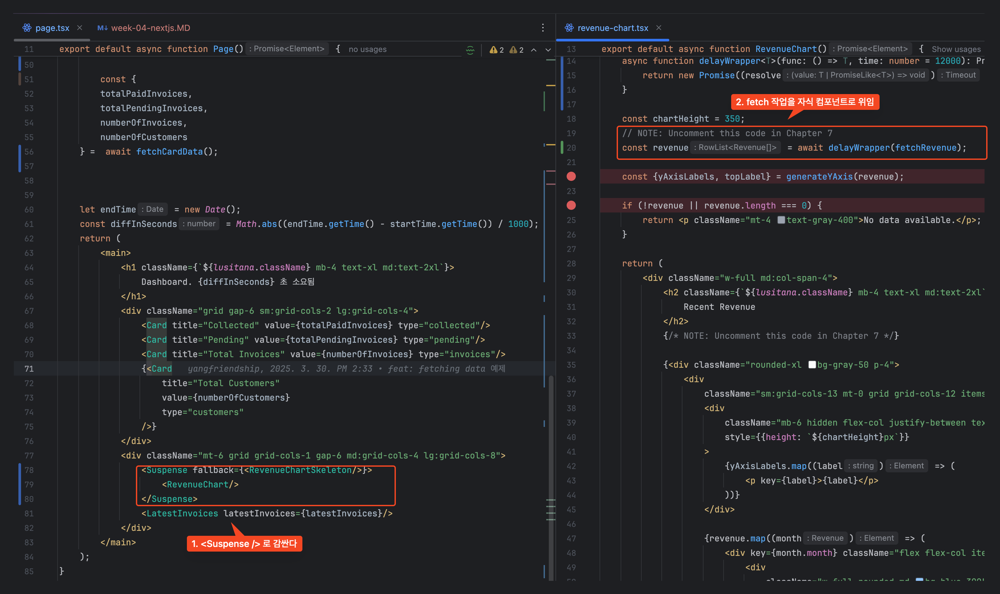
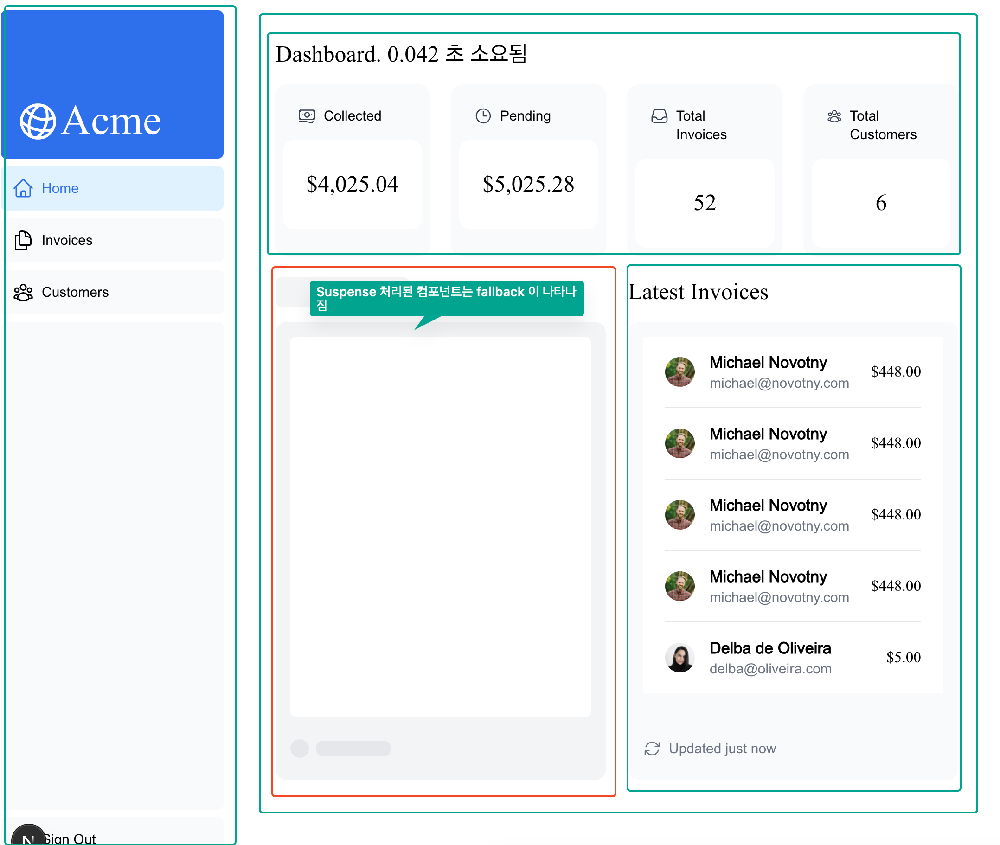
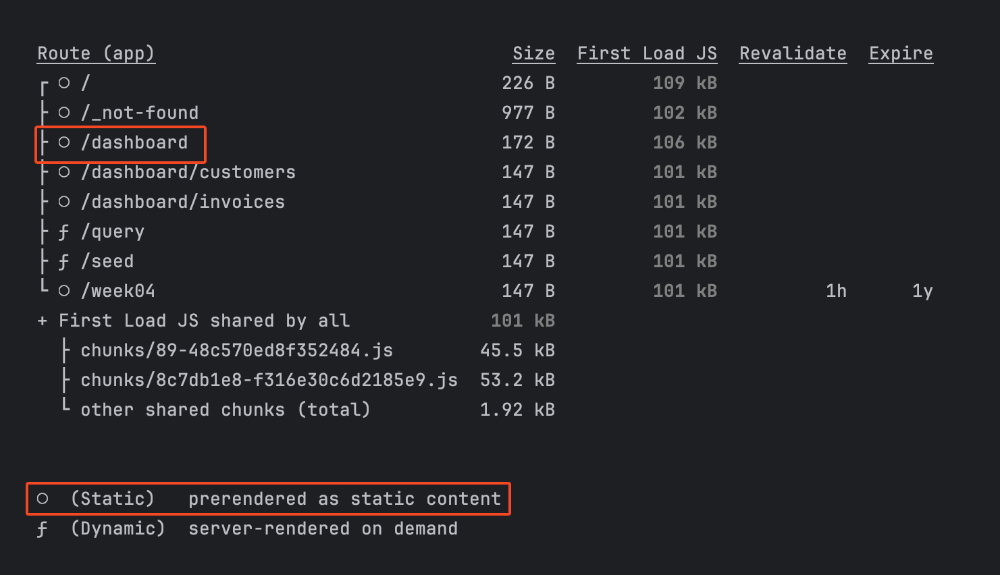
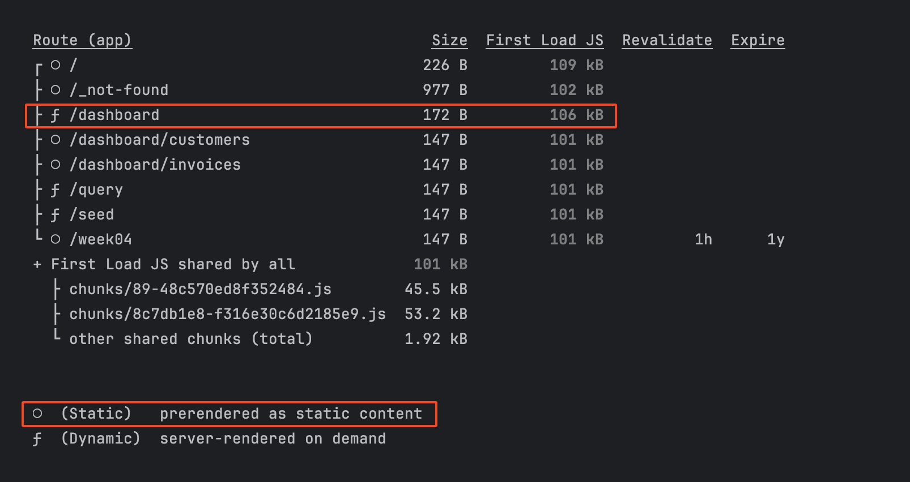
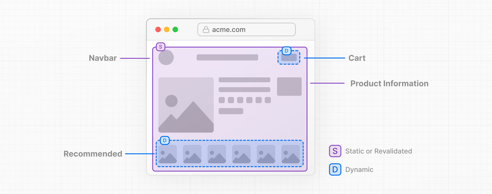
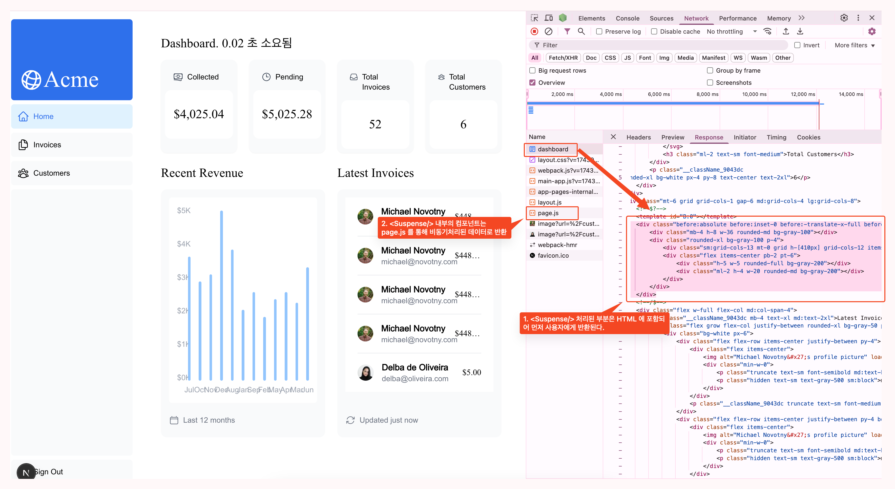
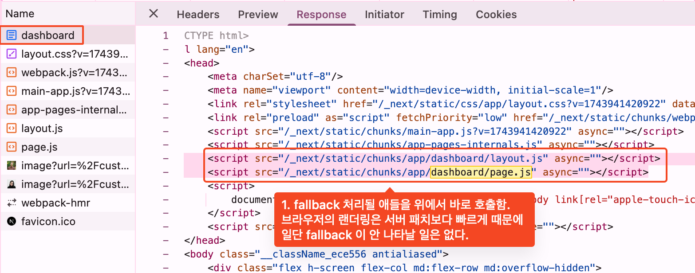

# 스터디 3주차 (4/6) - Static and Dynamic Rendering

## 정적 렌더링이란?

- 정적 렌더링의 경우, 데이터 페치 및 렌더링은 빌드 시점(배포 시) 또는 데이터 재검증 시 서버에서 발생
- 정적 렌더링은 데이터가 없거나 사용자 간에 공유되는 데이터가 있는 UI에 유용
    - 사이트 약관 페이지
    - 정적 블로그 게시물
    - 제품 페이지
- 정기적으로 업데이트되는 개인화된 데이터가 있는 대시보드에는 적합하지 않다.
- 정적 렌더링의 반대는 `동적 렌더링`
    - 일반적으로 사용하는 렌더링 방식

## 동적 렌더링이란?

- 사용자의 요청마다 새롭게 페이지를 랜더링하는 방식
    - 실시간 데이터 - 동적 렌더링을 통해 애플리케이션에서 실시간 또는 자주 업데이트되는 데이터를 표시할 수 있습니다. 이는 데이터가 자주 변경되는 애플리케이션에 이상적이다.
    - 사용자별 콘텐츠 - 대시보드나 사용자 프로필과 같은 개인화된 콘텐츠를 제공하고 사용자 상호 작용을 기반으로 데이터를 업데이트하는 것이 더 쉽습니다.
    - 요청 시간 정보 - 동적 렌더링을 사용하면 쿠키나 URL 검색 매개변수와 같이 요청 시점에서만 알 수 있는 정보에 액세스할 수 있습니다.
- 정적인 페이지를 재사용할 수 없는 모든 상황은 동적 렌더링으로 동작한다.
    - `브라우저에서 얻을 수 있는 정보`로만 페이지를 렌더링할 수 없다면(추가적인 데이터가 필요) 동적 렌더링을 사용해야함.

# 스터디 3주차 (4/6) - Streaming

## 스트리밍이란?

- 스트리밍은 경로를 더 작은 "조각"으로 나누고 데이터가 준비되면 서버에서 클라이언트로 `점진적으로` 스트리밍할 수 있는 데이터 전송 기술
- Next.js에서 스트리밍을 구현하는 방법은 두 가지가 있다.
    - 페이지 수준에서 `loading.tsx` 파일을 사용하여 (사용자를 위해 생성되는 <Suspense>)
    - 컴포넌트 수준에서는 `<Suspense>` 보다 세부적인 제어가 가능합니다.

## `loading.tsx` 를 이용한 페이지 전체 스트리밍

> app/  
> ├── dashboard/  
> │ ├── layout.tsx // /dashboard 전용 레이아웃   
> │ ├── page.tsx    
> │ ├── _loading.tsx // /dashboard 로딩 UI   
> │ └── error.tsx

- 위와 같이 패키지 구조에 _loading.tsx 를 위치시키면 layout + _loading.tsx 를 이용한 HTML 을 빠르게 응답하고
- 반환한 html 내부의 page.js 를 통해 page 부분을 비로소 요청한다.
- page 내부에서 필요한 데이터가 비동기로 조회하는 경우라면 사용자에게 먼저 loading(스켈레톤) 페이지를 보여주는 것!

## Grouping components

- `<Suspense />` 를 이용한 컴포넌트 스트리밍은 페이지를 구성하는 컴포넌트들을 그룹화하여 사용할 수 있다.
- 아래 이미지와 같이 `<Suspense />` 특정 컴포넌트를 그룹화하여 사용하면 해당 컴포넌트가 로딩되는 동안 다른 컴포넌트는 렌더링이 가능하다.
  
  

- 추가로.. 예제코드를 실제로 빌드하고 실행해보면 fallback UI 가 로딩되지 않고 빠르게 페이지가 로드되는 걸 볼 수 있는데
- dev 환경에서는 정적파일을 생성하지 않아 매번 페이지를 랜더링하느라 스트리밍을 관측할 수 있는 것이며 운영으로 올라갈 땐 정적 파일로 만들어져 볼 수가 없었다.
  > 예제를 빌드할 경우 결과 메시지
  > 
  > `export const dynamic = 'force-dynamic';`를 통해 명시적으로 동적 렌더링을 지정 후 빌드 결과 메시지
  > 

# 부분 사전 렌더링

## 부분 사전 렌더링이란 무엇인가?

- 동일한 경로에서 `정적 렌더링`과 `동적 렌더링`의 이점을 결합할 수 있는 새로운 렌더링 모델
  

## 어떻게 동작하나요?

- 부분 사전 렌더링은 React의 Suspense를 사용한다.
- Suspense 폴백은 정적 콘텐츠와 함께 초기 HTML 파일에 내장되며 정적 콘텐츠는 정적 셸을 생성하기 위해 사전 렌더링된다.
- 이전장 예제의 페이지가 랜더링되는 과정에서 호출한 네트워크를 분석해보면..
    - dashboard HTML 내부에 `<Suspense>` 의 fallback 이 포함되어 반환된다.
    - `<Suspense>` 내부의 컴포넌트는 page.js 를 통해 비동기로 호출된다.
      
      

## PPR 을 이용한 부분 사전 렌더링 구현

- 이해가 되질 않아 생략하겠습니다.
- 함께 토론해주세요!