# 스터디 3주차 (4/6) - UI 표현하기

- React는 사용자 인터페이스(UI)를 렌더링하기 위한 JavaScript 라이브러리
    - 버튼, 텍스트, 이미지와 같은 작은 요소로 구성
    - 작은 요소들을 **재사용 가능** 하고 **중첩**할 수 있는 컴포넌트로 조합할 수 있음

# 첫 번째 컴포넌트

## 학습 내용

- 컴포넌트가 무엇일까
- React 애플리케이션에서 컴포넌트의 역할
- 첫 번째 React 컴포넌트를 작성하는 방법

## 컴포넌트: UI 구성 요소

- 웹에서는 HTML을 통해 <h1>, <li>와 같은 태그를 사용하여 풍부한 구조의 문서를 만들 수 있다.
- React를 사용하면 마크업, CSS, JavaScript를 앱의 재사용 가능한 UI 요소인 사용자 정의 “컴포넌트”로 결합할 수 있다.
- 이미 작성한 컴포넌트를 재사용하여 많은 디자인을 구성할 수 있으므로 개발 속도를 향상시킬 수 있다.

## 컴포넌트 정의하기

- 기존에는 웹 페이지를 만들 때 웹 개발자가 컨텐츠를 마크업한 다음 JavaScript를 뿌려 상호작용을 추가
- 이제는 많은 사이트와 모든 앱에서 상호작용을 기대 -> 현대 웹 사이트와 애플리케이션에서는 상호작용은 **필수**
- React 컴포넌트는 마크업으로 뿌릴 수 있는 JavaScript 함수 -> 함수를 통해 컴포넌트를 표현할 수 있다.

```tsx
/* (1) */
export default function Profile() { /* (2) */
    return (
        
    )
}
```

1. 1단계: 컴포넌트 내보내기
    - **export default** 키워드를 통해 js 파일에 정의한 컴포넌트를 외부로 내보낸다.

2. 2단계: 함수 정의하기
    - 위 절에서 언급했듯이 리액트의 컴포넌트는 함수로 표현(정의)할 수 있다.
    - 재활용 가능한 컴포넌트를 Profile 이라는 **함수** 로 정의했다.

3. 3단계: 마크업 추가하기
    - 예제코드의 컴포넌트는 src, alt 속성을 가진 img 태그를 반환한다.
    - 최상의 일리먼트(img) 는 HTML 처럼 작성되었지만 JavaScript로 작성된 [JSX](https://ko.react.dev/learn/writing-markup-with-jsx) 문법이다.

> 💡괄호가 없으면 return 뒷 라인에 있는 모든 코드가 무시된다 <br>
> ```tsx
> 
> // 1. return 문 뒤에 JSX 코드가 있지만 괄호가 없으므로 무시된다. 
> return
> <div>
>     
> </div>
> ;
> 
> // 2. 가독성이 좋지 못하지만 동작은 한다.
> return <div></div>;
> 
> // 3. 괄호를 통해 JSX 코드가 return 문에 포함된다.
> return (
>     <div>
>         
>     </div>
> );
> 
> ```

## 컴포넌트 사용하기

이제 Profile 컴포넌트를 정의했으므로 다른 컴포넌트 안에 중첩할 수 있습니다. 예를 들어 여러 Profile 컴포넌트를 사용하는 Gallery 컴포넌트를 내보낼 수 <br>
있습니다.

```tsx
// 예제 코드
function Profile() {
    return (
        
    );
}

export default function Gallery() {
    return (
        <section>
            <h1>Amazing scientists</h1>
            <Profile/>
            <Profile/>
            <Profile/>
        </section>
    );
}
```

### 브라우저에 표시되는 내용

대소문자의 차이에 주목하세요.

- ```<section>``` 은 소문자이므로 React는 HTML태그를 가리킨다고 이해합니다.
- <Profile />은 대문자 p로 시작하므로 React는 Profile이라는 컴포넌트를 사용하고자 한다고 이해합니다. <br>
  그리고 Profile은 더 많은 ```****``` 가 포함되어 있습니다. 결국 브라우저에 표시되는 내용은 다음과 같습니다.

### 컴포넌트 중첩 및 구성

- 컴포넌트는 일반 JavaScript함수이므로 같은 파일에 여러 컴포넌트를 포함할 수 있다.
- Gallery는 각 Profile을 “자식”으로 렌더링하는 부모 컴포넌트라고 말할 수 있다.

```text
Gallery (부모 컴포넌트)
├── h1 (Amazings scientists)
└── Profile (img)  (자식 컴포넌트)
    ├── 
    ├── (반복) Profile
    └── (반복) Profile
```

### 요약

- Gallery는 각 Profile을 “자식”으로 렌더링하는 부모 컴포넌트라고 말할 수 있습니다React를 사용하면 앱의 재사용 가능한 UI 요소인 컴포넌트를 만들 수 있습니다.
- React 앱에서 모든 UI는 컴포넌트입니다.
- React 컴포넌트는 다음 몇 가지를 제외하고는 일반적인 JavaScript 함수입니다.
    - 컴포넌트의 이름은 항상 대문자로 시작합니다.
    - JSX 마크업을 반환합니다.

## 챌린지 도전하기

### 컴포넌트 내보내기

```tsx
// 예제 코드
function Profile() {
    return (
        
    );
}

// 수정된 코드
// 'export default' 키워드가 추가 됐다. 
export default function Profile() {
    return (
        
    );
}

```

### return문을 고치세요

```tsx
// 예제 코드
export default function Profile() {
    return
    ;
}

// 수정1
export default function Profile() {
    return ;
}

// 수정2
export default function Profile() {
    return (
        
    );
}


```

#### 실수를 찾아내세요

```tsx
// 예제코드
function profile() {
    return (
        
    );
}

export default function Gallery() {
    return (
        <section>
            <h1>Amazing scientists</h1>
            <profile/>
            <profile/>
            <profile/>
        </section>
    );
}

// 수정된 코드
// (1) 컴포넌트 함수의 이름을 **대문자** 로 변경
function Profile() {
    return (
        
    );
}

export default function Gallery() {
    return (
        <section>
            <h1>Amazing scientists</h1>
            {/* (2) 사용하는 클라이언트 쪽에서도 대문자로 해당 컴포넌트를 사용하도록 변경 */}
            <Profile/>
            <Profile/>
            <Profile/>
        </section>
    );
}
```

### 컴포넌트를 새로 작성해 보세요.

요구사항

- ```<h1>Good job!</h1>``` 를 반환하는 컴포넌트 생성

```tsx
// 아래에 컴포넌트를 작성해 보세요!
export default Congratulations = () => {
    return (
        <h1>Good job!</h1>
    );
}
```

# 컴포넌트 import 및 export 하기

## 학습 내용

- Root 컴포넌트란
- 컴포넌트를 import 하거나 export 하는 방법
- 언제 default 또는 named imports와 exports를 사용할지
- 한 파일에서 여러 컴포넌트를 import 하거나 export 하는 방법
- 여러 컴포넌트를 여러 파일로 분리하는 방법

## Root 컴포넌트란

첫 컴포넌트에서 만든 Profile 컴포넌트와 Gallery 컴포넌트는 아래와 같이 렌더링 됩니다.
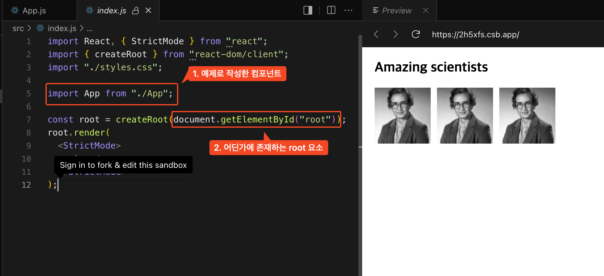

- 리액트는 도큐먼트 내부에 적용될 수 있지만 도큐먼트의 전체가 아닌 지정된 root 하위만 리액트로 구성할 수도 있다.
    - 모든 페이지가 리액트가 아닌 부분적으로 적용할 수 있다.

## 컴포넌트를 import 하거나 export 하는 방법

- React Component 는 **함수** 이기 때문에 js 파일에 정의할 수 있다.
- 재활용할 수 있도록 별도 js 파일로 분리된 컴포넌트는 js 의 모듈 시스템을 사용하여 import 하거나 export 할 수 있다.
- 공식문서 예제 내용은 생략하겠습니다.

> 💡Default와 Named Exports
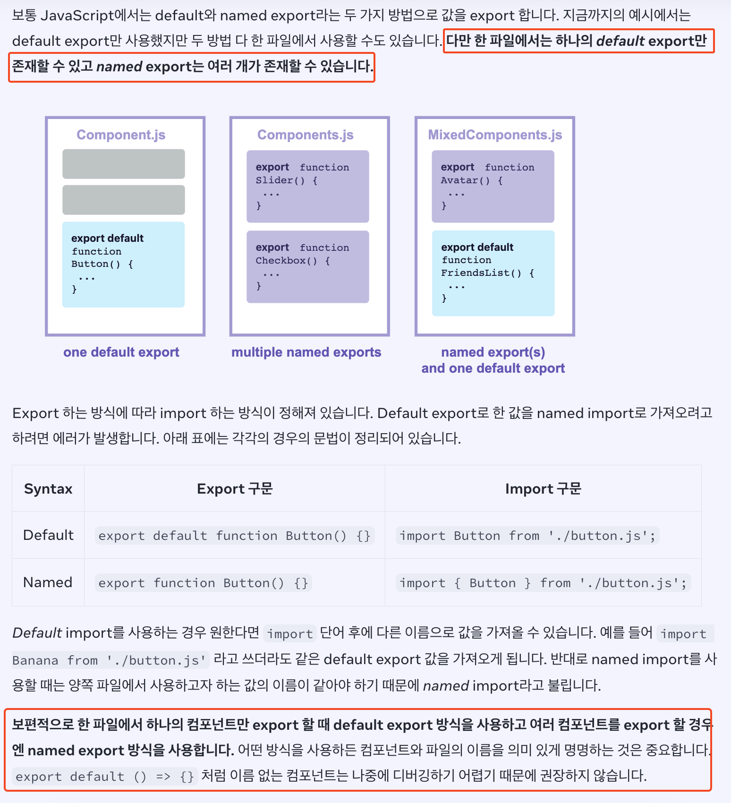

# JSX로 마크업 작성하기

JSX는 JavaScript를 확장한 문법으로, JavaScript 파일을 HTML과 비슷하게 마크업을 작성할 수 있도록 해준다. <br>
컴포넌트를 작성하는 다른 방법도 있지만, 대부분의 React 개발자는 JSX의 간결함을 선호하며 대부분의 코드 베이스에서 JSX를 사용합니다.

- Web은 HTML, CSS, JavaScript를 기반으로 만들어지며 보통은 `분리된 파일로 관리` 한다.
- Web이 더욱 인터랙티브해지면서, 로직이 내용을 결정하는 경우가 많아졌습니다. 그래서 JavaScript가 HTML을 담당하게 되었죠! <br>
  이것이 바로 React에서 렌더링 로직과 마크업이 같은 위치에 함께 있게 된 이유입니다. 즉, 컴포넌트에서 말이죠. <br>
  -> 사용자와 상호작용을 담당하는 js 를 통해 화면을 구성하는 일이 많아짐. 즉 JS 를 통해 HTML을 구성하는 일이 많아졌다.

> 기존에는 화면을 구성하는 HTML 과 상호작용을 담당하는 JS 이 분리되어 관리되었다.
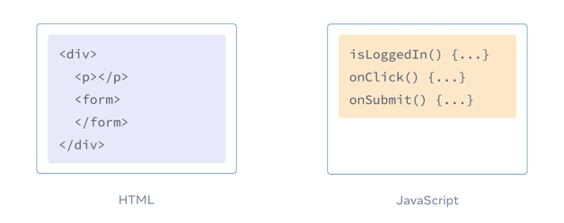

> 리액트에서는 이 두 개의 파일을 하나의 컴포넌트라는 단위로 관리한다.
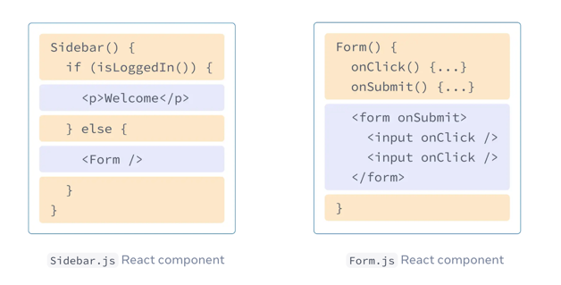

- 각 React 컴포넌트는 React가 브라우저에 마크업을 렌더링할 수 있는 JavaScript 함수

## JSX의 규칙

### 1. 하나의 루트 엘리먼트로 반환하기

- 한 컴포넌트에서 여러 엘리먼트를 반환하려면, 하나의 부모 태그로 감싸야한다.

```tsx
// 만약 랩핑해주는 부모 없이 여러 동일한 엘리먼틀를 반환할 경우, <> (Fragment) 감싸서 내보내야한다.
// (1) <> 이런 빈 태그를 이용하여 여러 엘리먼트를 감쌀 수 있다.
<>
    <h1>Hedy Lamarr's Todos</h1>
    
        <ul>
            ...
        </ul>
    </>
```

### 2. 모든 태그는 닫아주기

### 3. 거의 대부분 캐멀 케이스로!

- JSX는 JavaScript로 바뀌고 JSX에서 작성된 어트리뷰트는 JavaScript 객체의 키로 변환된다.
    - JSX 의 어트리부트는 JS 객체의 Key 로 변환되기 때문에 JS 변수의 규칙을 준수해야한다.
- 즉, JS 에서 절대 안되는 건 안되고 React 에서 정해진 규칙 또한 준수해야한다.

## 요약

- React 컴포넌트는 서로 관련이 있는 마크업과 렌더링 로직을 함께 **그룹화** 합니다.
- JSX는 HTML과 비슷하지만 몇 가지 차이점이 있습니다. 필요한 경우 변환기를 사용할 수 있습니다.
- 오류 메시지는 종종 마크업을 수정할 수 있도록 올바른 방향을 알려줍니다.
    - 라이브러리 또는 프레임워크 개념이기 때문에 준수해야하는 **규칙** 이 존재하기 때문에 그에 따른 **컴파일러** 또는 에디터 플러그인등을 지원해준다.

## 중괄호가 있는 JSX 안에서 자바스크립트 사용하기

- JavaScript 로직을 추가하거나 해당 마크업 내부의 동적인 프로퍼티를 참조하고 싶을 수 있다.
- JSX에서 `중괄호`를 사용하여 JavaScript를 사용할 수 있다.

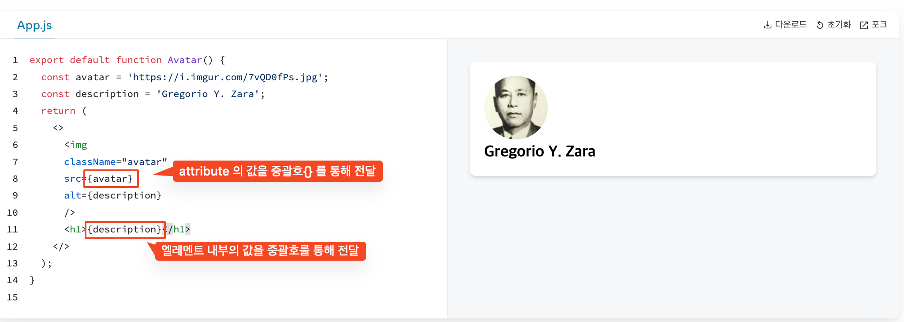

### 중괄호를 사용하는 곳

JSX 안에서 중괄호는 두 가지 방법으로만 사용할 수 있습니다. <br>

#### 중괄호를 사용하는 곳

JSX 태그 안의 문자: `<h1>{name}'s To Do List</h1>`는 작동하지만, `<{tag}>Gregorio Y. Zara's To Do List</{tag}>` 는 동작하지 않는다. <br>
= 바로 뒤에 오는 어트리뷰트: `src={avatar}는 avatar` 변수를 읽지만 `src="{avatar}"`는 `"{avatar}"` 문자열을 전달한다.

#### ”이중 중괄호” 사용하기: JSX의 CSS와 다른 객체

- 객체를 바로 값으로 넘길 땐 {} 로 한번 더 감싸야한다.

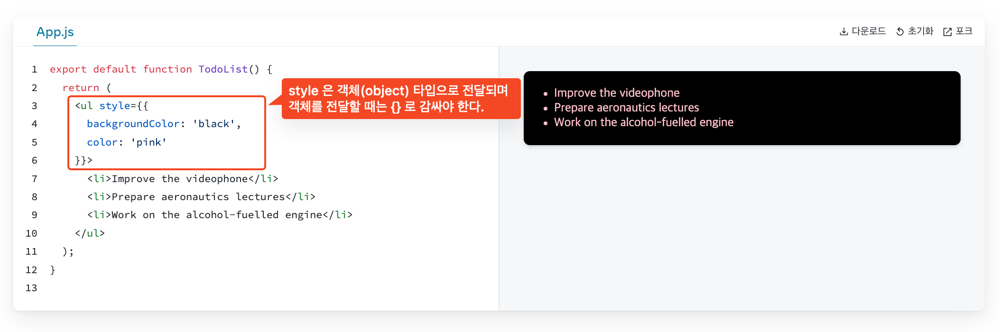

## 챌린지

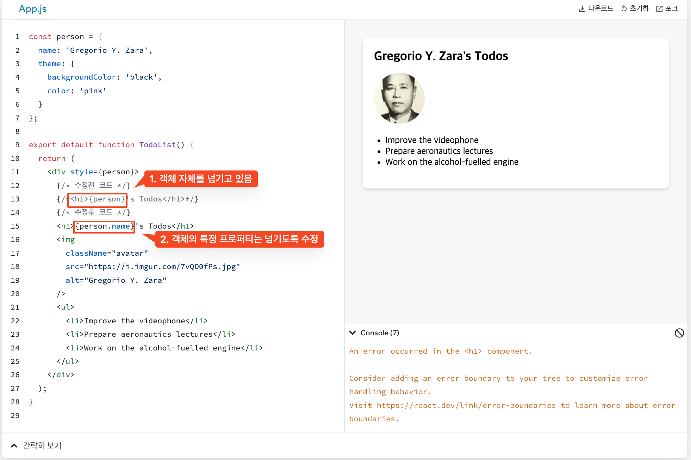

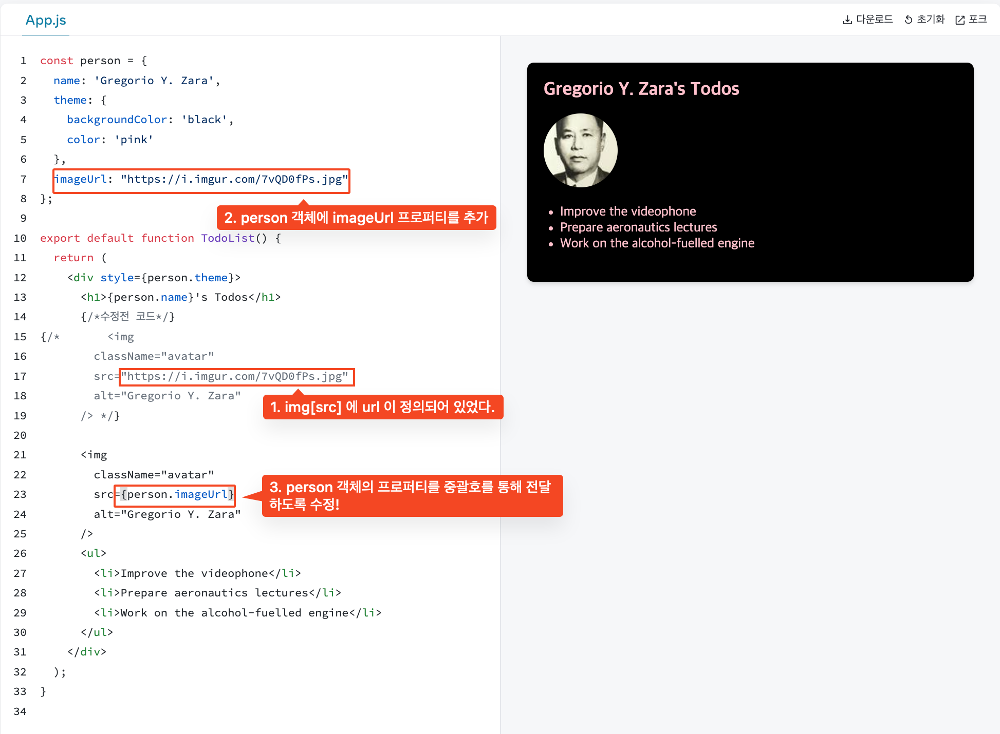

# 컴포넌트에 props 전달하기

- React 컴포넌트는 props를 이용해 서로 통신합니다. 모든 부모 컴포넌트는 props를 줌으로써 몇몇의 정보를 자식 컴포넌트에게 전달할 수 있다.
- 객체, 배열, 함수를 포함한 모든 JavaScript 값을 전달할 수 있다.

## 친숙한 props

## 2단계: 자식 컴포넌트 내부에서 props 읽기

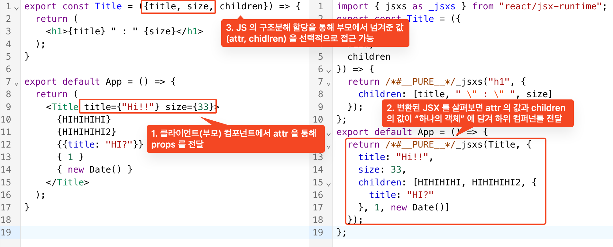

- 부모에서 내려준 props 와 children 은 다음과 같이 `하나의 오브젝트` 로 전달된다.
    - Q. jsx 내부에서 추가적인 프로퍼티를 추가해줄지도?

## JSX spread 문법으로 props 전달하기 

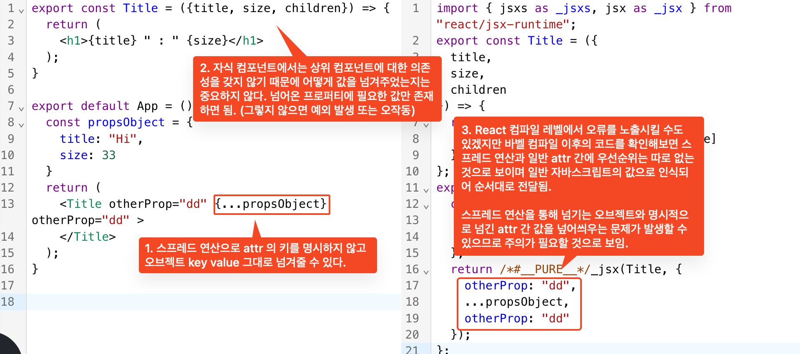


## 시간에 따라 props가 변하는 방식

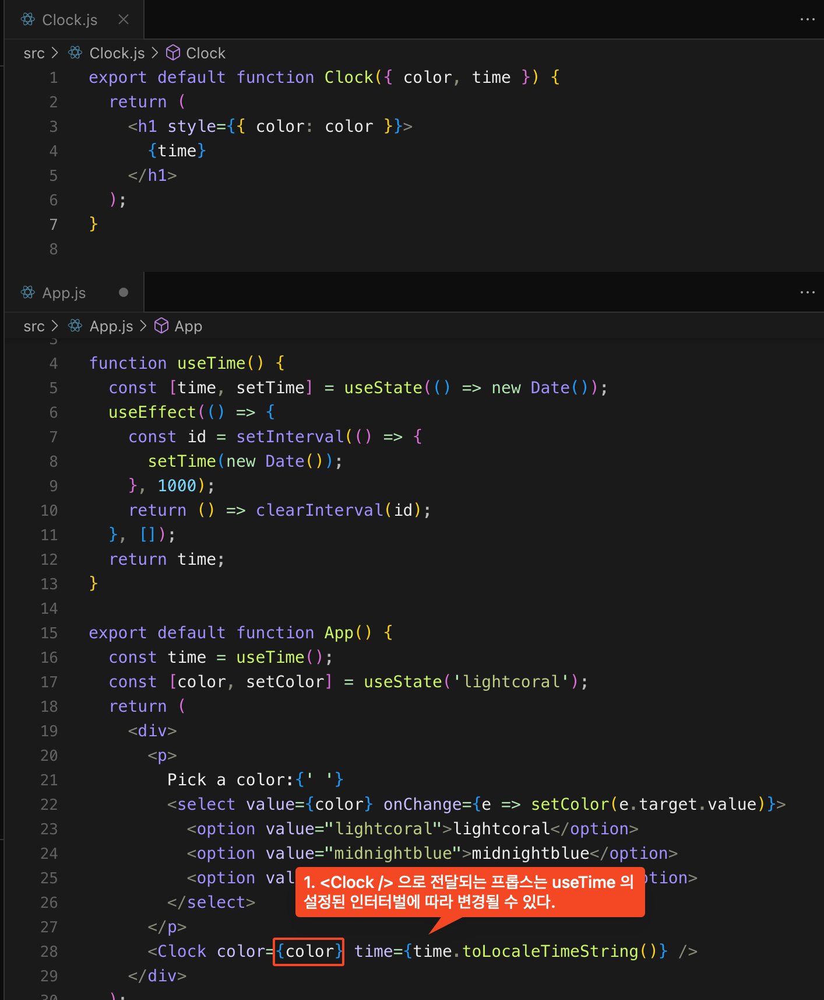

- 컴포넌트가 시간에 따라 다른 props를 받을 수 있음을 보여준다.
- props 자체는 하위 컴포넌트에서 일반적으로 변경할 수 있으며 전달받은 값을 변경할 수 있는 함수(트리거)를 통해서만 가능하다.
