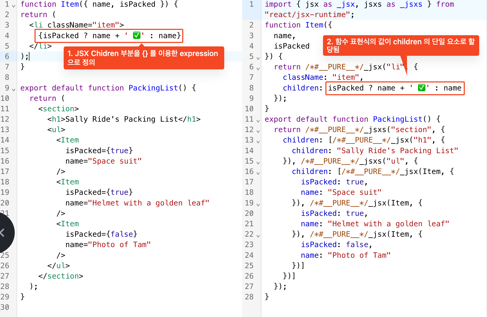

# 스터디 5주차 (4/13) - 조건부 렌더링

## 요약

- 함수 내부에서는 자유롭게 JS 를 통해 JSX 를 반환하면 된다.
- (return) JSX 내부 JS 표현({} 내부)
    - 다수의 ReactNode 타입의 값 또는 expression 을 반환할 수 있다.
    - 하위 컴포넌트(children)를 선언할 독립된 중괄호({}) 는 각각의 expression 으로 평가된다.  
      
    - 즉, JS 가 허용하는 expression 을 이용하여 조건부로 렌더링할 수 있다.
- 컴포넌트는 조건에 따라 다른 항목을 표시해야 하는 경우  `if 문, && 및 ? : 연산자` 와 같은 자바스크립트 문법을 사용하여 조건부로 JSX를 렌더링할 수 있다.

## 조건부로 JSX 반환하기

- 함수 내부의 props 를 기준으로 다른 JSX 트리를 반환할 수 있다.
  

## 조건부로 null을 사용하여 아무것도 반환하지 않기

- 아무것도 랜더링하고 싶지 않는다면 `null` 을 반환한다.

```tsx
if (isPacked) {
    return null;
}
return <li className="item">{name}</li>;
```

## 조건부로 JSX 포함시키기

- JSX return 문 내부의 값을 JS 조건문을 통해 제어할 수 있다.
    - 삼항 조건 연산자
    - 논리 AND 연산자 (`&&`)



## 변수에 조건부로 JSX를 할당하기


## 요약

- React에서 JavaScript로 분기 로직을 제어합니다.
- 조건부로 if 문과 함께 JSX 식을 반환할 수 있습니다.
- 조건부로 일부 JSX를 변수에 저장한 다음 중괄호를 사용하여 다른 JSX에 포함할 수 있습니다.
- JSX에서 `{cond ? <A /> : <B />}`는 “cond이면 <A />를 렌더링하고, 그렇지 않으면 <B />를 렌더링합니다.” 를 의미합니다.
- JSX에서 `{cond && <A />}`는 “cond이면, `<A />`를 렌더링하되, 그렇지 않으면 아무것도 렌더링하지 않습니다.” 를 의미합니다.
  위 예시는 흔한 방법이지만, if를 선호한다면 사용하지 않아도 됩니다.

# 리스트 렌더링

## 배열의 항목들을 필터링하기

- 아래의 과정을 통해 리액트 컴포넌트를 랜더링할 수 있다.
    - Input(props) -> Process(filter, map.. JS Code) -> Output(ReactNode Type Value)


## key를 사용해서 리스트 항목을 순서대로 유지하기

- 각 배열 항목에 다른 항목 중에서 고유하게 식별할 수 있는 문자열 또는 숫자를 key로 지정해야 한다.
- key 가 동일하다면 동일한 엘리멘트로 인식하고 내부적으로 diffing 을 처리한다.
- 예를 들어 아이템 item = {name: "item1", price: "1000"} 을 넘겨서 완전 새로운 인스턴스이지만
  name, price 쓰는 부분만 실제 브라우저 돔에 변경함.
  변경된 것처럼 보이지만 실제로는 동일한 브라우저 돔을 사용하는 것 물리적인 이동이 이뤄진 건 아니다.

- [KEY 예제 코드](https://codepen.io/moonkorea00/pen/YzdzoPx)

# 컴포넌트를 순수하게 유지하기

- 자바스크립트 함수는 순수하며 순수 함수는 오직 연산만을 수행한다.
- React는 작성되는 모든 컴포넌트가 순수 함수일 거라 가정한다.
    - 외부 영향을 받는 모든 것을 side effect (의도하지(않은) 결과) 로 정의한다.
      
- 순수함수는 테스트가 용이하며 외부 의존성 낮출 수 있다는 장점이 있어 소프트웨어 개발 및 테스트가 용이하다.

## 요약

- 컴포넌트는 순수해야만 합니다. 이것은 두가지를 의미합니다.
    - 자신의 일에 집중합니다. 렌더링 전에 존재했던 객체나 변수를 변경하지 않아야 합니다. -> `응집도` UP
    - 같은 입력, 같은 출력. 입력이 같을 경우, 컴포넌트는 항상 같은 JSX를 반환해야 합니다.
- 렌더링은 언제든지 발생할 수 있으므로 컴포넌트는 서로의 렌더링 순서에 의존하지 않아야 합니다.
- 컴포넌트가 렌더링을 위해 사용하는 입력을 변경해서는 안됩니다. 여기에는 Props, State, Context가 포함됩니다.
  화면을 업데이트하려면 기존 객체를 변경하는 대신 State를 “설정”하세요.
- 반환하는 JSX에서 컴포넌트의 로직을 표현하기 위해 노력하세요. “무언가를 변경”해야 할 경우 일반적으로 이벤트 핸들러에서 변경하고 싶을 것입니다.  <br>
  마지막 수단으로 useEffect를 사용할 수 있습니다.
- 순수 함수를 작성하는 것은 약간의 연습이 필요하지만, React 패러다임의 힘을 발휘합니다.

## 순수함수에 대한 고찰..

- 웹 애플리케이션을 개발하는 입장에서 모든 기능을 순수함수로 작성하기에는 무리가 많다.
    - 웹 애플리케이션은 외부 API, DB 등 외부의 데이터를 이용하는 경우가 많기 때문에 쉽지가 않다.
    - 너무 복잡하다: 비즈니스 로직의 변경이 순수함수 자체(요구사항)를 변경해야하는 경우를 발생시키기 쉬움.
- 그럼에도 `순수함수` 를 지향해야하는 이유
    - 순수함수를 작성은 작은 크기의 코드를 갖는 응집도 높은 코드 작성을 유도한다.
    - 작아진 코드는 함수 목적이 명확하며 여러 곳에서 재활용될 수 있다.
    - 외부 의존성(DB, API) 등을 함수 내부가 아닌 props 등으로 처리한다면 함수 자체의 테스트가 용이하다.

# 트리로서 UI 이해하기

- React 앱은 서로 중첩된 많은 컴포넌트로 구성되어 있으며 애플리케이션을 트리로 생각하면 컴포넌트 간의 관계를 이해하는 데 도움이 된다.

## 트리로서의 UI 

- 